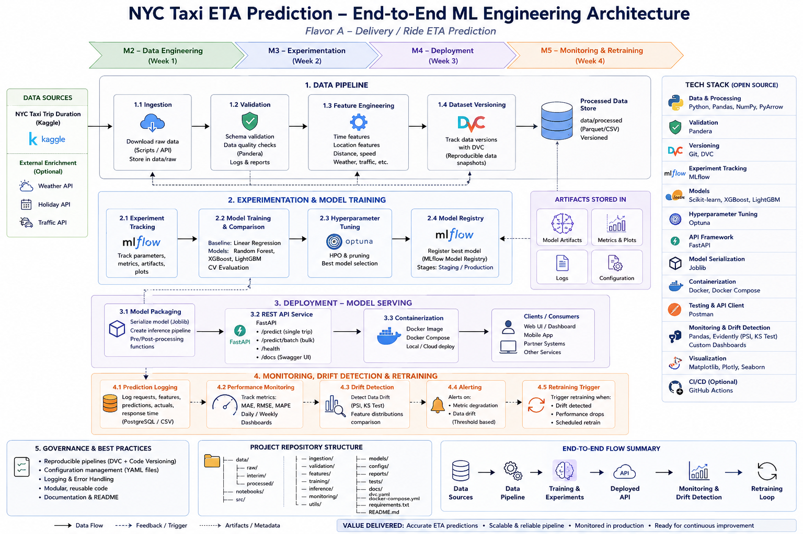

# 🏗️ NYC Taxi ETA Prediction – Architecture Guide

This document captures the complete architectural design of the **NYC Taxi ETA Prediction** project.

It serves as the official design document (**Phase 1 – Project Design**) and explains how the system is structured before implementation begins.

---

# 📑 Table of Contents

- [1. Objective](#1-objective)
- [2. System Architecture](#2-system-architecture)
- [3. Repository Structure](#3-repository-structure)
- [4. Technology Stack](#4-technology-stack)
- [5. End-to-End Workflow](#5-end-to-end-workflow)
- [6. Data Flow](#6-data-flow)
- [7. Component Interactions](#7-component-interactions)
- [8. System Components](#8-system-components)
- [9. Design Principles](#9-design-principles)
- [10. Future Enhancements](#10-future-enhancements)
- [11. Conclusion](#11-conclusion)

---

# 1. Objective

The objective of this document is to design the overall architecture of the **NYC Taxi ETA Prediction** system before implementation begins.

Rather than treating this as a traditional Machine Learning assignment, the project is designed as a complete **Machine Learning Engineering System**, covering the entire lifecycle from data ingestion to production monitoring and retraining.

---

# 2. System Architecture

## Architecture Overview

<p align="center">
    
</p>

---

## Design Philosophy

Unlike a traditional Machine Learning assignment that focuses only on model training, this project is designed as a complete **Machine Learning System**.

The architecture emphasizes:

- Reproducibility
- Modular design
- Experiment tracking
- Dataset versioning
- Model deployment
- Production monitoring
- Continuous improvement

Every component has a clearly defined responsibility and communicates through well-defined interfaces.

---

# 3. Repository Structure

The repository is organized around the Machine Learning lifecycle rather than individual assignment tasks.

```text
NYC-Taxi-ETA-Prediction/

├── data/
├── notebooks/
├── src/
├── models/
├── docs/
├── reports/
├── tests/
├── configs/
├── requirements.txt
├── Dockerfile
├── docker-compose.yml
├── dvc.yaml
└── README.md
```

The repository structure promotes:

- Modular development
- Separation of concerns
- Reusability
- Maintainability

---

# 4. Technology Stack

| Layer | Technology |
|--------|------------|
| Programming Language | Python |
| Development Environment | VS Code + Virtual Environment (.venv) |
| Data Processing | Pandas, NumPy, PyArrow |
| Data Validation | Pandera |
| Dataset Versioning | DVC |
| Version Control | Git |
| Experiment Tracking | MLflow |
| Machine Learning | Scikit-learn, XGBoost, LightGBM |
| Hyperparameter Tuning | Optuna |
| Model Serialization | Joblib |
| REST API | FastAPI |
| Containerization | Docker, Docker Compose |
| API Testing | Postman |
| Monitoring | Evidently (PSI, KS Test) + Custom Monitoring |
| Visualization | Matplotlib, Plotly |
| CI/CD (Optional) | GitHub Actions |

---

# 5. End-to-End Workflow

The complete workflow consists of four major phases.

```text
Kaggle Dataset
        │
        ▼
Data Engineering
        │
        ▼
Model Training & Experimentation
        │
        ▼
Model Deployment
        │
        ▼
Monitoring & Retraining
```

Each phase builds upon the previous one, forming a complete Machine Learning Engineering pipeline.

---

# 6. Data Flow

The data flows through the system in the following order.

```text
Raw Dataset
      │
      ▼
Validation
      │
      ▼
Feature Engineering
      │
      ▼
Processed Dataset
      │
      ▼
DVC Versioning
      │
      ▼
Model Training
      │
      ▼
Model Registry
      │
      ▼
Deployment
      │
      ▼
Predictions
      │
      ▼
Monitoring
      │
      ▼
Retraining
```

The processed dataset is versioned before model training to ensure complete reproducibility.

---

# 7. Component Interactions

The architecture is composed of independent components, each with a single responsibility.

| Component | Consumes | Produces |
|-----------|----------|----------|
| Data Ingestion | Kaggle Dataset | Raw Dataset |
| Data Validation | Raw Dataset | Validated Dataset |
| Feature Engineering | Validated Dataset | Processed Dataset |
| Dataset Versioning | Processed Dataset | Versioned Dataset |
| Model Training | Processed Dataset | Trained Models |
| Experiment Tracking | Training Results | Metrics & Artifacts |
| Model Registry | Best Model | Production Candidate |
| FastAPI Service | Registered Model | Predictions |
| Monitoring | Predictions + Actual Values | Performance Reports |
| Drift Detection | Prediction Logs | Drift Metrics |
| Retraining | Drift Metrics | New Training Pipeline |

Each module communicates through clearly defined inputs and outputs, making the system easier to maintain and extend.

---

# 8. System Components

## Week 1 — Data Engineering (M2)

Responsible for preparing production-quality training data.

Components:

- Data Ingestion
- Data Validation
- Feature Engineering
- Dataset Versioning (DVC)

Output:

- Versioned processed dataset

---

## Week 2 — Experimentation & Model Training (M3)

Responsible for building and selecting the best prediction model.

Components:

- MLflow Experiment Tracking
- Model Training
- Model Comparison
- Hyperparameter Tuning (Optuna)
- Model Registry

Output:

- Best trained model
- Metrics
- Training artifacts

---

## Week 3 — Deployment (M4)

Responsible for serving predictions.

Components:

- Model Packaging
- FastAPI REST Service
- Docker Containerization

Output:

- REST API for ETA prediction

---

## Week 4 — Monitoring & Retraining (M5)

Responsible for ensuring model quality after deployment.

Components:

- Prediction Logging
- Performance Monitoring
- Drift Detection
- Alerting
- Retraining Trigger

Output:

- Production monitoring dashboard
- Drift reports
- Retraining decisions

---

# 9. Design Principles

The following engineering principles guide the implementation of this project:

- Modular design with clear separation of responsibilities.
- Reproducible experiments using Git, DVC, and MLflow.
- Configuration-driven development.
- Version-controlled datasets and source code.
- Production-oriented deployment using FastAPI and Docker.
- Continuous monitoring for performance degradation and data drift.
- Extensible architecture for future production enhancements.

---

# 10. Future Enhancements

The current implementation focuses strictly on the project requirements for **Flavor A**.

However, the architecture is intentionally designed to support future enhancements such as:

- Feature Store (Feast)
- Automated CI/CD pipeline
- Cloud deployment
- Scheduled retraining
- Model Registry promotion workflows
- Real-time monitoring dashboards
- Online feature serving

These enhancements are not part of the current implementation but can be integrated without major architectural changes.

---

# 11. Conclusion

This architecture represents a complete **Machine Learning Engineering System** rather than a standalone Machine Learning model.

It demonstrates how data engineering, experimentation, deployment, monitoring, and continuous improvement work together to build reliable, production-ready Machine Learning applications.